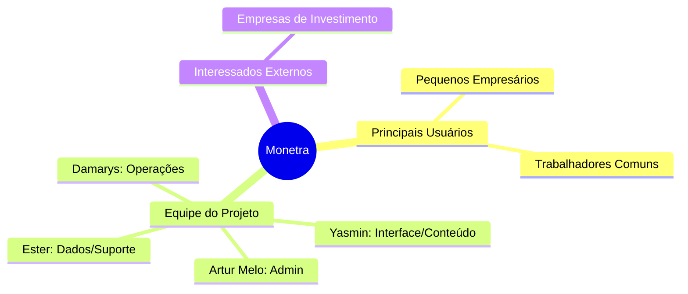

### **1. Visão Geral**
   
   O Monetra é uma solução voltada para pessoas comuns e pequenos empresários que enfrentam dificuldades no controle de suas finanças. Diferente de planilhas isoladas, o app combina funcionalidades práticas de gestão com uma linguagem educativa sobre o mercado financeiro.  
   
   * Status do Projeto: Em Revisão.  
   * Versão: 1.0.  
   * Metodologia: RUP (Fase de Elaboração). 

### **2. Escopo do Produto**

   2.1 Funcionalidades principais 
* Gestão de Planilhas: Criação e edição de tabelas financeiras personalizadas
* Organização de Gastos: Controle mensal detalhado de despesas
* Lembretes Ativos: Notificações de boletos, contas e assinaturas pendentes
* Monitoramento de Cripto: Tabela em tempo real com cotações de criptomoedas em Real (R$) 
* Educação Financeira: Feed de notícias e atualizações sobre o mundo dos investimentos

###  2.2 Fora de Escopo
* Sugestões de investimento baseadas no perfil do cliente 
* Escaneamento de documentos e recibos físicos

### 3.1 Requisitos Funcionais (Principais)

| ID | Requisito | Prioridade | Responsável |
| :--- | :--- | :--- | :--- |
| **RF001** | Permitir o gerenciamento de ganhos e perdas | Alta | Yasmin Ribeiro |
| **RF002** | Controlar acesso ao sistema baseado em perfis (Usuário/Admin) | Alta | Artur Melo |
| **RF003** | Enviar notificações por e-mail sobre eventos relevantes | Baixa | Ester |
| **RF004** | Monitoramento de desempenho e fluxos financeiros | Média | Damarys |

   3.2 Requisitos não Funcionais
* Desempenho: Resposta a 95% das requisições em menos de 3 segundos
* Segurança: Comunicação via TLS/HTTPS e senhas armazenadas com hash bcrypt
* Escalabilidade: Suporte para até 5.000 usuários simultâneos
* Disponibilidade: Mínima de 99% em horário comercial

### **4. Arquitetura e tecnologias**
   * O sistema é desenvolvido como uma aplicação Web Stand-alone.
   * Banco de Dados: Relacional (PostgreSQL ou MySQL).
   * Integrações: Servidor SMTP para envio de notificações por e-mail.
   * Compatibilidade: Navegadores modernos como Chrome, Firefox, Edge e Safari.

### **5. Partes Interessadas (Stakeholders)**
* Pequenos Empresários: Usuários e aprovadores do sistema.  
* Trabalhadores: Usuários finais.  
* Empresas de Investimento: Potenciais investidores no projeto. 
* Equipe de TI: Responsável pelo suporte e manutenção.

### 5.1 Mapa de Stakeholders

### **6. Riscos identificados**
* Mudança de Escopo: Gerido através do controle rígido de mudanças do processo RUP 
* Dificuldade de Adoção: Mitigado através de treinamentos e manuais de usuário
